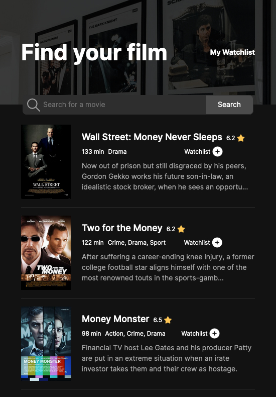
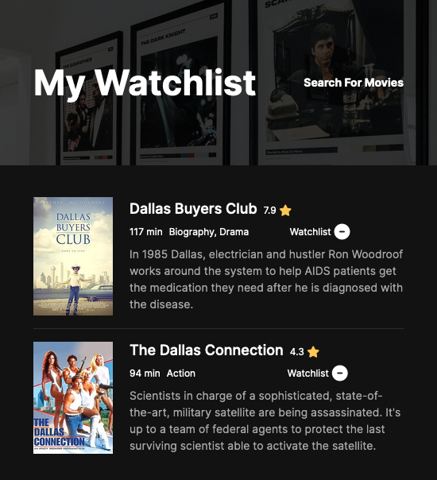

# Scrimba - Soloproject Movie Watchlist

This is a solution to Module 8 - Movie Watchlist of [The Frontend Developer Career Path](https://scrimba.com/learn/frontend). Scrimba SoloProjects help to improve your coding skills by building projects.

## Table of contents

- [Overview](#overview)
  - [Requirements](#requirements)
  - [Screenshot](#screenshot)
  - [Links](#links)
- [My process](#my-process)
  - [Built with](#built-with)
  - [Continued development](#continued-development)
  - [Useful resources](#useful-resources)
- [Author](#author)

## Overview

### Requirements

- Two html-pages - `index.html` and `watchlist.html`
- `index.html` = search page. Calls to [OMDB API](https://www.omdbapi.com/) with the title searched for and display search results
- Button to 'add to watchlist' which saves that data to local storage
- `watchlist.html `loads and displays data from local storage
- Two/Three (?) javaScript-files: `app.js`, `watchlist.js` and `index.js`.

### Screenshot

### Links

- Solution URL: [Github](https://github.com/graficdoctor/solo-project-movie-watchlist)
- Live Site URL: [Vercel](https://solo-project-movie-watchlist.vercel.app/)

## My process

### Built with

- Semantic HTML5 markup
- CSS custom properties
- Flexbox
- CSS Grid
- Mobile-first workflow

### Continued development

There is an error upon importing functions from `app.js` to `watchlist.js`. This is why I created an `index.js` and populated it with the `updateDisplayState`-function. I know I could import `createMovieItem` aswell, but I didn't figure out the reason for the error-message regarding the `eventListener` on the `searchButton` it then throws. This is something I have to update later on.

Another error I want to point out, for which I couldn't find the solution is; Inside `createMovieItem` I create every element seperately and append them accordingly. However, for the `movie-score` inside the `movie-title` and the button inside `movie-details__additional`, the text should be after the image. I will also update this later.

### Useful resources

- [Placing a Button on Top of an Input using CSS](https://icodethis.com/blog/button-on-top-of-input)
- [Light and dark mode in just 14 lines of CSS](https://whitep4nth3r.com/blog/quick-light-dark-mode-css/)

## Author

- Website - [Katrien S.](https://www.katriens.be)
- Twitter - [@graficdoctor](https://www.twitter.com/graficdoctor)
